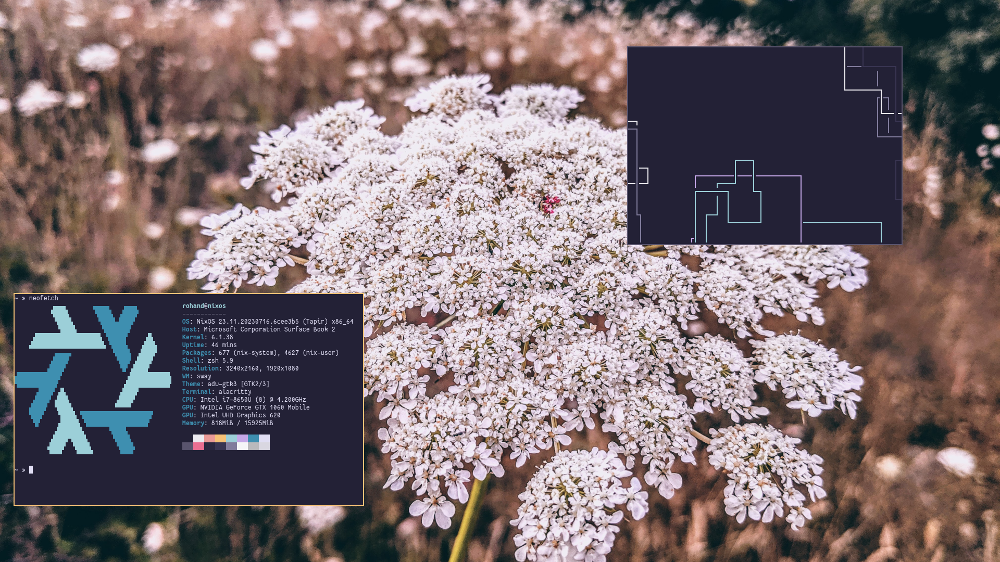

# sb2-nixos-config
My NixOS config files for my Surface Book 2, managed by 
[`home-manager`](https://github.com/nix-community/home-manager)

This definitely needs some cleaning up, but it's a good first start for at least a frame of reference. It uses some pretty vanilla configs, nothing crazy going on like impermanence and ZFS, just regular good-old ext4 partitions.

Inspired by Luke Smith's [LARBS](https://github.com/LukeSmithxyz/LARBS), which was my first foray in the world of WM's, I wanted to recreate a similar config on NixOS. It runs many of the same minimalist programs, like Zathura, but just uses Wayland and Sway, as well as some Wayland replacements for minimalist programs, like `bemenu` to replace `dmenu`.

-   [Installation](#installation)
-   [Screenshots](#screenshots)
-   [To-Do](#to-do)


## Installation
This should only be used as a frame of reference, as some of the hardware configuration is specific for my laptop, such as my partitions. However, it can be deployed running:

```
sudo nixos-rebuild switch --flake /etc/nixos#surface --impure
```

After this is ran, the installed ZSH shell will have an alias for the above command called `update`, so that can be run instead.

## Screenshots


This screenshot is using the base16 rosepine color scheme, found in [this](https://github.com/tinted-theming/base16-schemes) repo and [wallpapers](https://github.com/rose-pine/wallpapers) from the rose pine Github repo.
If you wanted to change the color scheme, it's managed by [Stylix](https://github.com/danth/stylix/).
Edit the line in the [`home.nix`](./home.nix) file that contains

```
stylix.base16Scheme = "${pkgs.base16-schemes}/share/themes/rose-pine-moon.yaml";
```

and change the YAML file into the scheme that you want from the base16-schemes repo. Not all schemes work, and I don't really know why. 
The ones I do like work, and I'm happy with that.
If you want to change the wallpaper, that's located in the [`flake.nix`](./flake.nix) file.
Edit the line in the file that contains

```
stylix.image = /home/rohand/Downloads/flower.jpg;
```

and change it to the wallpaper you like. The wallpaper in the screenshot isn't provided in this repository, but it can be found on the rose-pine wallpapers repo that I linked before.

## To-do
Some more programs have to be added, and some more ways to improve declarability should also be there. 
Firefox extensions so far aren't declared in the files, and I haven't figured out how to use NUR yet with the nixOS home-manager module. 
Some other miscellaneous things, like a status bar (although i don't need one) can be added, although this is commented out in the [`home.nix`](./home.nix) file under the sway module. 


